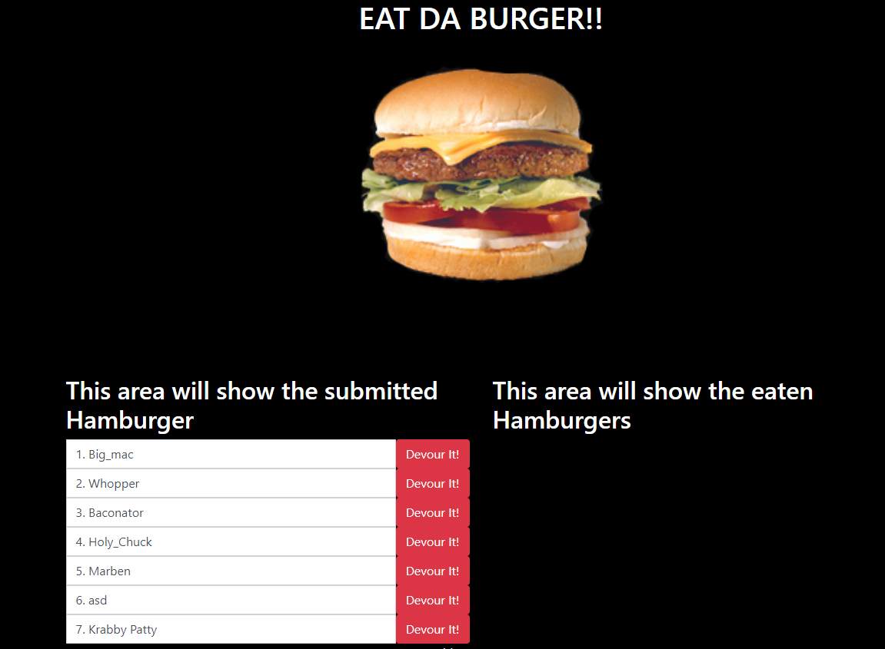

# Eat The Burger            
## License 
                                 

## Description
This application was created as a fun project to test my skills and learn more about express, handlebars and mysql.

## Table of Contents
* [Installation](#Installation-Guide)
* [Usage](#Usage)
* [Contributors](#Contributors)
* [Contact-Information](#contact-Information)

## Installation Guide
Clone this repo!
        
## Usage
run npm install and start server.js on node.
        
## Contributors
Jesus Rios

## Contact Information
Github Username - [JesusFernandoRios](http://github.com/JesusFernandoRios)

E-mail - jesusfernandorios@outlook.com
